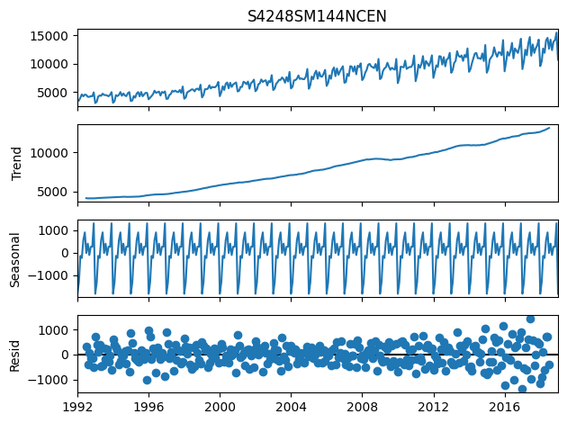

# Прогнозирование временных рядов

### Документация написана для дальнейшего повторного обучения, сохранения некоторых шпаргалок.
### За самый расписанный считать файл RNN - LSTM Arch.ipynb - в нем самый подробный код
## Используемые библиотеки и датасет


Для обработки, нормализации и вывода данных
```python
import pandas as pd
import numpy as np
import matplotlib.pyplot as plt
from sklearn.preprocessing import MinMaxScaler
from sklearn.metrics import mean_squared_error
from math import sqrt
```
Для объявления модели, создание уровней
```python

from keras.models import Sequential
from keras.layers import Dense
from keras.layers import LSTM, GRU, SimpleRNN
```
Для автоматического распределения временных рядов
```python
from statsmodels.tsa.seasonal import seasonal_decompose
```


## Используемый Датасет
[Датасет](https://www.kaggle.com/datasets/bulentsiyah/for-simple-exercises-time-series-forecasting?select=Alcohol_Sales.csv)

## Особенности

### Выбор датасета
Датасет имеет грамотно нормализированную структуру, обладает структурированным временным промежутком, в котором возможно распределять временные ряды. Стоит обратить внимание на:

```python
Alco.index.freq='MS'
```
Код заточен под структуру гггг-мм-дд, датасеты с другой струтурой (D, B и т.д.) потребуют изменений

> **Грамотно**: *Это можно будет определить на этапе инициализации - система сама выведет, что дата имеет другой формат*

Обратите внимание на графики



У вас должны быть читаемые Seasonal и Resid, иначе модель не сможет грамотно работать - временные ряды не выражены

Обучение проводилось на 100 эпохах - при таком размере лучше всего видна разница между LSTM, GRU, собственными архитектура

Практика показывает, что LSTM обладает лучшей архитектурой для предсказаний временных рядов, благодаря краткосрочной долговременной памятью

## Стоит добавить, что в папке 3 ipynb файла - LSTM, GRU, MyArch1 - исследование, что лучше. Подробнее все отражено в отдельном .docx отчете